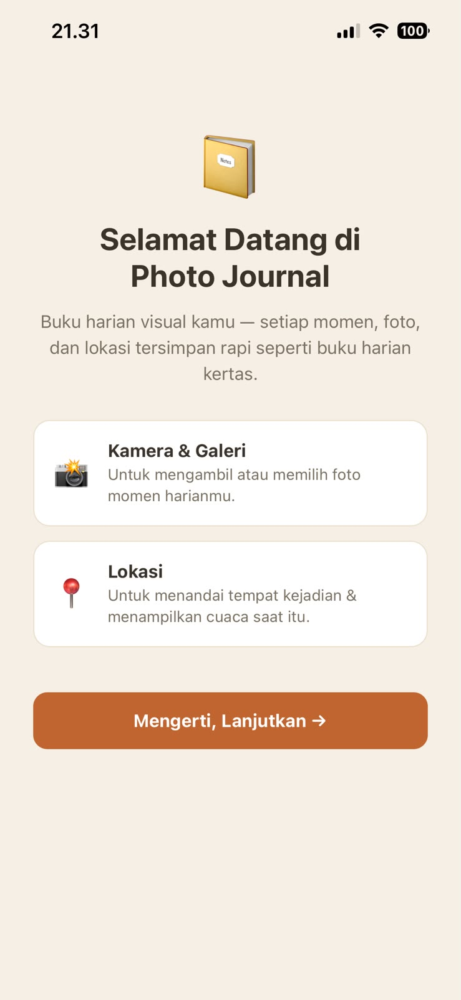
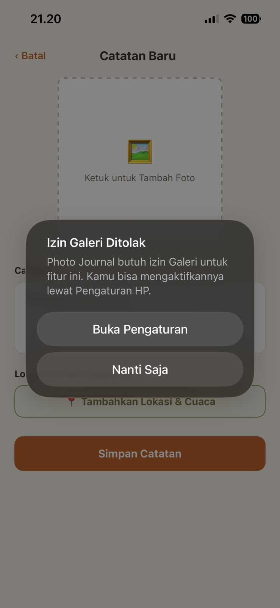
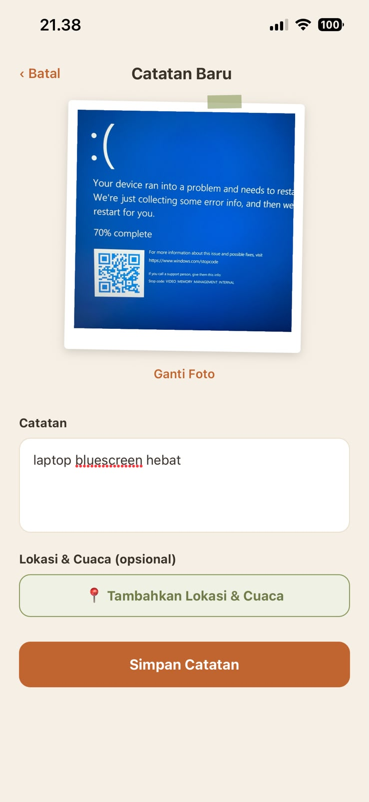
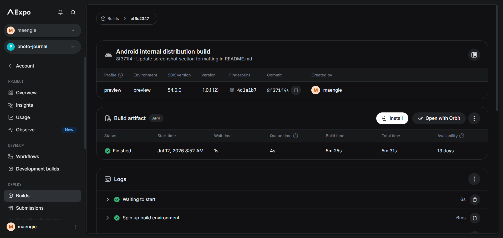
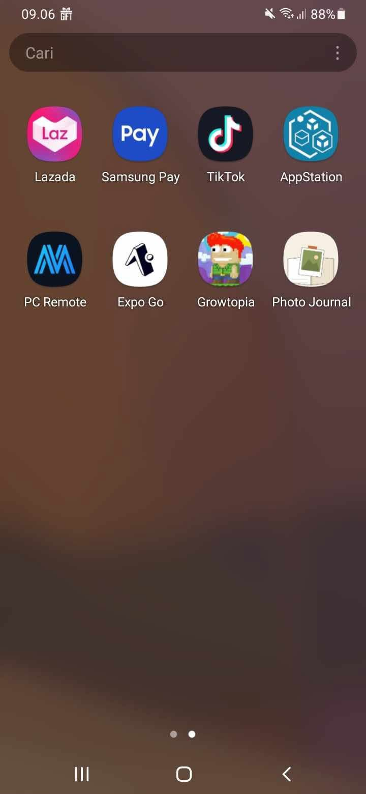
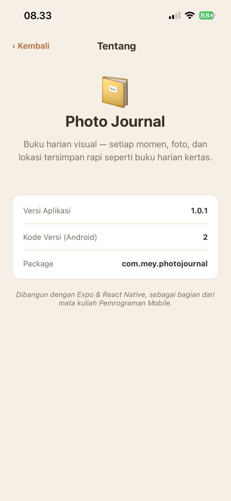
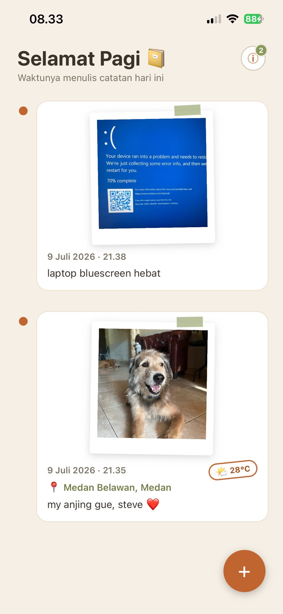

# 📔 Photo Journal

Buku harian visual berbasis React Native (Expo) — setiap momen, foto, lokasi, dan cuaca tersimpan rapi dengan tampilan ala buku harian kertas ("Paper Journal").

Dibangun untuk **Mission 13: Native Power App** dan dirilis sebagai APK untuk **Mission 14: Menyiapkan Aplikasi untuk Rilis**.

---

## 🎨 Konsep Desain — "Buku Harian Kertas"

Bukan UI kartu-kotak generic bergaya Instagram. Konsep yang dipakai:

- Latar krem hangat (`#F5EFE4`), bukan putih polos
- Foto ditampilkan seperti polaroid: rotasi kecil, border putih tebal, "washi tape" di sudut
- Timeline vertikal dengan garis putus-putus penghubung antar entry
- Aksen warna terracotta (`#C1652F`) & sage green (`#8A9A5B`)
- Cuaca ditampilkan sebagai "stempel pos" mungil di tiap entry

---

## 📸 Screenshot

| Priming Screen | Permission Denied |
|---|---|
|  |  |

| Home Timeline | New Entry |
|---|---|
|  |  |

| APK EAS Build FINISHED |
|---|
|  |

| APK Terinstall di HP |
|---|
|  |

--- 

## ✨ Fitur

### Level 1 — Core (wajib)
- Akses kamera **dan** galeri dengan permission flow yang benar (`requestPermissionsAsync` → cek `status === 'granted'` → baru akses fitur)
- Penolakan izin ditangani dengan `Alert` ramah + tombol ke Pengaturan, tanpa crash
- Cek `result.canceled` sebelum mengambil `assets[0].uri`
- Lokasi diambil & ditampilkan sebagai koordinat + nama tempat
- UI menampilkan hasil foto & koordinat secara rapi

### Level 2 — Pengembangan (6/6 diambil)
| Fitur | Implementasi |
|---|---|
| 📸 Kamera + Galeri | Alert pilihan sumber foto sebelum membuka picker |
| 📍 Kamera + Lokasi | Satu entry berisi foto **dan** koordinat + nama tempat |
| 💾 Persistensi | Semua entry disimpan/dimuat lewat `AsyncStorage` |
| 🗺️ Buka di Maps | Tombol di halaman Detail membuka koordinat via `Linking` |
| 🔁 Tombol Settings | Saat izin ditolak, `Alert` menyediakan tombol `Linking.openSettings()` |
| 🖼️ Galeri Multi-Foto | Seluruh entry (dengan foto masing-masing) ditampilkan dalam `FlatList` timeline |

### Level 3 — Bonus P13 (5/5 diambil)
- 🌦️ **GPS + Cuaca**: koordinat dikirim ke Open-Meteo (`api.open-meteo.com`), hasil ditampilkan sebagai stempel cuaca
- 🧭 **Priming screen**: layar penjelasan izin sebelum dialog sistem muncul (ditampilkan sekali, status disimpan di `AsyncStorage`)
- 🏘️ **Reverse geocoding**: koordinat diubah jadi nama kecamatan/kota lewat `Location.reverseGeocodeAsync`
- ⚙️ **app.json lengkap**: usage description + permission Android + config plugin `expo-image-picker` & `expo-location`
- 🗑️ **Hapus foto**: tombol di halaman Detail mereset foto entry menjadi placeholder tanpa menghapus catatannya

### Level 3 — Bonus P14
| Bonus | Status | Keterangan |
|---|---|---|
| **A — App Version Display** | ✅ | Halaman "Tentang" (ikon ⓘ di Home) menampilkan versi app, version code, dan package name lewat `expo-constants` |
| **B — Expo Snack link** | ✅ | [Buka di Expo Snack](https://snack.expo.dev/@maengie/photojournal) |
| **C — Update UI** | ✅ | Menambahkan greeting dinamis ("Selamat Pagi/Siang/Sore/Malam 📔") + badge angka jumlah entry di tombol ⓘ, dirilis sebagai versi `1.0.1` (versionCode `2`) |

| Halaman About | Update UI (Greeting & Badge) |
|---|---|
|  |  |

---

## 🛠️ Tech Stack

- **React Native** + **Expo SDK 54** (template blank)
- `expo-image-picker` — akses kamera & galeri
- `expo-location` — GPS & reverse geocoding
- `@react-native-async-storage/async-storage` — persistensi lokal
- `expo-constants` — baca info versi app dari `app.json` (Bonus A)
- [Open-Meteo API](https://open-meteo.com/) — data cuaca (gratis, tanpa API key)
- Navigasi disatukan dalam satu `App.js` menggunakan state (`priming | home | new | detail | about`) — tanpa library navigasi tambahan
- EAS Build — build APK release

---

## ▶️ Cara Menjalankan (Development)

```bash
# 1. Buat project dari template (jika mulai dari nol)
npx create-expo-app@latest photo-journal --template blank@sdk-54
cd photo-journal

# 2. Install dependency
npm install

# 3. Jalankan
npx expo start
```

Scan QR code dengan aplikasi **Expo Go** di HP fisik (Android/iOS).

---

## 📦 Cara Install APK (Release)

1. Download APK dari link berikut: **https://expo.dev/accounts/maengie/projects/photo-journal/builds/ef6c2347-3c7b-4649-ad82-4f7097f61e6a**
2. Buka file APK di HP Android
3. Jika muncul peringatan "sumber tidak dikenal", izinkan instalasi dari sumber tersebut
4. Buka app **Photo Journal** dari app drawer

---

## 🔁 Catatan Versi

Aplikasi ini dirilis sebagai satu build versi `1.0.1` (versionCode `2`) — sudah termasuk fitur sapaan dinamis berdasarkan waktu dan badge jumlah entry di header Home (lihat Bonus C di atas).

---

## 🔗 Tautan

- **Expo Snack:** https://snack.expo.dev/@maengie/photojournal
- **Link download APK (EAS):** https://expo.dev/accounts/maengie/projects/photo-journal/builds/ef6c2347-3c7b-4649-ad82-4f7097f61e6a

---

## 📋 Info Rilis

| Field | Nilai |
|---|---|
| Package name | `com.mey.photojournal` |
| Versi saat ini | `1.0.1` |
| Version code | `2` |
| Build profile | `preview` (APK) |
